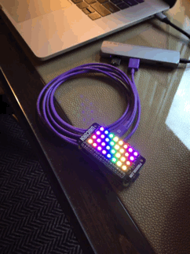

# Blinkchain

[](https://coveralls.io/github/GregMefford/blinkchain?branch=master)

Drive WS2812B "NeoPixel" RGB LED strips from a Raspberry Pi using Elixir!



This project was designed to make it easy to drive a string of AdaFruit
NeoPixels from a Raspberry Pi using [Nerves](http://nerves-project.org). The
code would probably also work outside of Nerves with minor modifications to the
Makefile, if you so desire.

> NOTE: This library used to be called `nerves_neopixel`. The reason for the
> new name and major version bump is that I wanted to overhaul the API and
> also make it less-specific to Nerves and NeoPixels. For example, it could be
> used in the future to control DotStar LED chains from Raspbian Linux.
>
> If you're looking for the source for the last version of `nerves_neopixel`,
> you can find it [here](https://github.com/GregMefford/blinkchain/tree/v0.4.0).

## Installation

Add it to your list of dependencies in `mix.exs`:

```elixir
  def deps do
    [{:blinkchain, "~> 1.0"}]
  end
```

If you've cloned the `blinkchain` repository, be sure to check out the
`rpi_ws281x` submodule:

```sh
$ git submodule init
$ git submodule update
```

## Connections

Only a subset of GPIO pins on the Raspberry Pis can control the NeoPixels. See
[GPIO Usage](https://github.com/jgarff/rpi_ws281x#gpio-usage) for details.
Additionally, since the Raspberry Pi has 3.3V I/O outputs and the NeoPixels
require 5V I/O input, you'll need a level shifter to convert between voltages.

You can read more about using NeoPixels with Nerves in [my blog post about the
project](http://www.gregmefford.com/blog/2016/01/22/driving-neopixels-with-elixir-and-nerves).

## Usage

Supervision trees and an Elixir `Port` are used to maintain fault-tolerance
when interfacing with the low-level driver, which is written in C. For example,
let's imagine that you want to drive a [Pimoroni Unicorn pHAT], which has a
grid of 8 by 4 NeoPixels, and an [Adafruit NeoPixel Stick], which has a row of
8 NeoPixels. If we put the Stick next to the pHAT, we can imagine a virtual
drawing canvas that is 8 pixels wide and 5 pixels tall, like so:

[Pimoroni Unicorn pHAT]: https://shop.pimoroni.com/products/unicorn-phat
[Adafruit NeoPixel Stick]: https://www.adafruit.com/product/1426

```
# Y  X: 0  1  2  3  4  5  6  7
# 0  [  0  1  2  3  4  5  6  7 ] <- Adafruit NeoPixel Stick on Channel 1 (pin 13)
#    |-------------------------|
# 1  |  0  1  2  3  4  5  6  7 |
# 2  |  8  9 10 11 12 13 14 15 | <- Pimoroni Unicorn pHat on Channel 0 (pin 18)
# 3  | 16 17 18 19 20 21 22 23 |
# 4  | 24 25 26 27 28 29 30 31 |
#    |-------------------------|
```

First, you need to configure which GPIO pin(s) to use and how the pixels are
arranged in each chain on the virtual drawing canvas:

```elixir
# config/config.exs
use Mix.Config

config :blinkchain,
  canvas: {8, 5}

config :blinkchain, :channel0,
  pin: 18,
  type: :grb,
  brightness: 32,
  gamma: gamma,
  arrangement: [
    %{
      type: :matrix,
      origin: {0, 1},
      count: {8, 4},
      direction: {:right, :down},
      progressive: true
    }
  ]

config :blinkchain, :channel1,
  pin: 13,
  type: :grb,
  brightness: 32,
  gamma: gamma,
  arrangement: [
    %{
      type: :strip,
      origin: {0, 0},
      count: 8,
      direction: :right
    }
  ]
```

Then, in your application code, you can use the various [Blinkchain API]
drawing commands to set the color of each pixel on the virtual canvas before
calling `Blinkchain.render/0` to present the virtual canvas onto the physical
NeoPixel LEDs. For example, to generate a scrolling rainbow pattern, assuming
that `c1` through `c5` are updated for each frame, you can do:

[Blinkchain API]: https://hexdocs.pm/blinkchain

```elixir
# lib/rainbow/worker.ex

# Shift all pixels to the right
Blinkchain.copy(%Point{x: 0, y: 0}, %Point{x: 1, y: 0}, 7, 5)

# Populate the five leftmost pixels with new colors
Blinkchain.set_pixel(%Point{x: 0, y: 0}, c1)
Blinkchain.set_pixel(%Point{x: 0, y: 1}, c2)
Blinkchain.set_pixel(%Point{x: 0, y: 2}, c3)
Blinkchain.set_pixel(%Point{x: 0, y: 3}, c4)
Blinkchain.set_pixel(%Point{x: 0, y: 4}, c5)

Blinkchain.render()
```

To see more about how this code works or try it out for yourself, check out
[the included `rainbow` example](https://github.com/GregMefford/blinkchain/tree/master/examples/rainbow).

## DMA Channel Selection

We have occasionally seen issues on particular combinations of hardware and
Raspberry Pi-provided firmware versions where there is a conflict between the
DMA channels used by Blinkchain and the ones used internally by the Raspberry
Pi firmware. You will probably never need to change this, but in case you
experience stability issues where the OS process is crashing, you might want to
try changing the DMA channel to see if that helps.

```elixir
# config/config.exs
use Mix.Config

config :blinkchain, dma_channel: 5 # <= The default is 5
```
